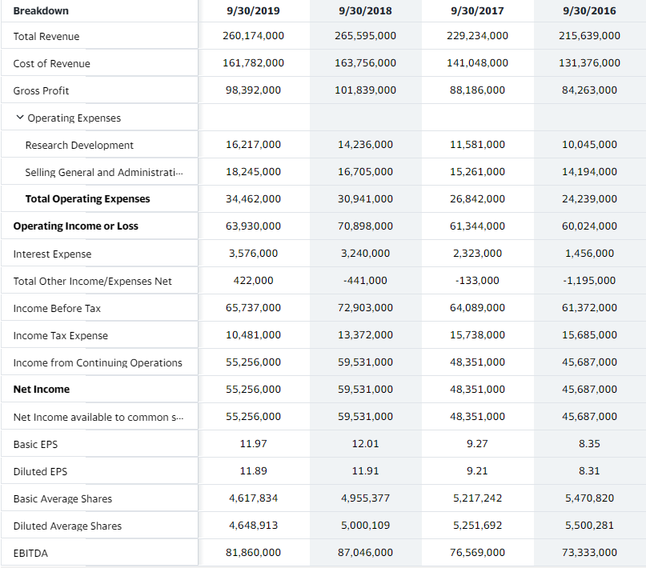

# 财报分析 & 公司估值

## 资产负债表

资产负债表：

- 反应时点状态 = 一家公司的家底

主要关注科目：

### Asset

- current asset（排列顺序通常代表可变现的速度）
  - cash and cash equivalents 
  - account receivables 越多代表市场竞争越大
  - inventory 
  - other – 通常这部分资产不会为公司带来利益

- non-current asset：
  - PP&E – 鉴别产业结构，越高Long Term Debt也会越高`

例子：

### Liabilities and stockholders' equity

- current liabilities
  * account payable – 越多代表可以赊账越多，公司主动权高
- stockholders' equity
  - paid-in capital – 投钱得股
  * retained earnings – 净收入减去分配的股息

例子：

## 利润表

例子：

## 现金流量表

公司的活动

- 经营operating
- 投资 investing
- 筹资 financing

|                | [Operating] Core Business              |     [Operating] Other Business    | [Investment] Fixed Assets    | [Investment] Investment                                              | [Financing] Debt             |     [Financing] Equity    |
|----------------|----------------------------------------|-----------------------------------|------------------------------|----------------------------------------------------------------------|------------------------------|---------------------------|
|     Inflow     |     Sales Tax                          |     Sales Tax                     |     Disposal                 |     Disposal    Investment income     股票（运气）/实业（可持续）    |     Raise money              |     Raise money           |
|     Outflow    |     Procurement    Salary，     Tax    |     Rent    Tax                   |     Purchase or construct    |     Invest                                                           |     Interest    principal    |     Dividend              |

- 作为资产 – 固定资产 – 与未来有关 – 计入资产负债表– 现金流量表流出
- 作为费用 – 广告费用 – 只与当期有关 – 计入利润表 – 现金流量表流出
- 当资产价值有保证时，利润表相对更重要，如果会出现贬值,则现金流更重要

|          |     Operating CF    |     Investment CF    |     Financing CF    |                                                    |
|----------|---------------------|----------------------|---------------------|----------------------------------------------------|
|     1    |     +               |     +                |     +               |     融资有限，预防资金不足/有不良动机              |
|     2    |     +               |     +                |     -               |     成熟型 – 还贷，为股东分红                      |
|     3    |     +               |     -                |     +               |     大量融资进行投资，投资风险-方向/规模/节奏      |
|     4    |     +               |     -                |     -               |     看净流量，经营活动                             |
|          |     初创/衰退       |     竞争激励         |                     |                                                    |
|     5    |     -               |     +                |     +               |     看投资收益来源                                 |
|     6    |     -               |     +                |     -               |     变卖资产还债                                   |
|     7    |     -               |     -                |     +               |     初创/衰退-新业务转型（too   late）3-earlier    |
|     8    |     -               |     -                |     -               |     凉凉                                           |

例子：

## 分析方法

### 同型分析

把所有科目占总资产/收入的比率

### 盈利能力分析

毛利率 = 毛利润/营业收入
净利率 = 净利润/营业收入 ——反应效益

### 运营能力分析
`从现金回到现金，多少次每年`

#### 周转率

通常营业收入作分子，资产在一年内的平均水平作分母 （bg+Ed）/2

- 应收账款周转率 
- 流动资产周转率
- 固定资产周转率
- 存货周转率 = 成本/存货
- 总资产周转率 = 营业收入/总资产 ——反应效率

#### 总资产报酬率

总资产报酬率=净利润/总资产 = 净利润/营业收入 x 营业收入/总资产 

净资产报酬率=净利润/股东权益 = 净利润/总资产 x 总资产/股东权益
  - 权益乘数= 总资产/股东权益

投资资本报酬率= 税后净利润（包含利息）/投资资本（投资资本包含有息负债和股东权益）
- 资本成本：债权人 – 贷款利息 – 利率
- 股东 – 机会成本 – 平均收益率
- 加权平均资本成本（WACC）= 债权人比例x 贷款利率 + 股东比例 x 平均收益率
- 利息的税盾作用 - 贷款利率需乘上1-所得税利率

经济利润 =（投资资本报酬率-加权平均资本成本）x  投资资本
- 净利润大于0，而经济利润小于0，代表公司没有为股东创造价值

### 偿债能力分析

#### 短期偿债能力
- 流动比率 = 流动资产/流动负债 （乐观假设-所以流动资产能够很快变成现金）>3
- 速动比率=（流动资产-存货）/流动负债

#### 长期偿债能力：偿还利息&偿还本金
- 利息收入倍数 = 息税前收益/利息费用
- 资产负债率（财务杠杆）=负债/资产 
  - 高：重资产-航空公司
  - 低：资金充裕，流通高

## 肖星老师 youtube 学习资料

- 财务分析与决策 （list，此处只放第一集）



- 公司估值 （list，此处只放第一集）



