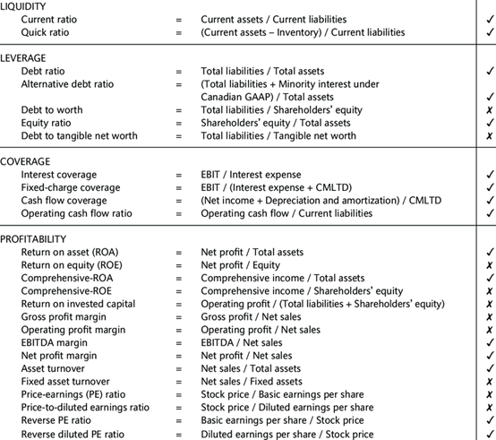
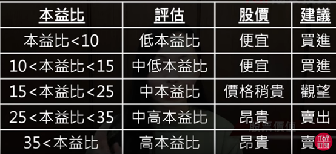

# 分析公司股票时的checklist

## 公司概况 checklist

公司简介

CEO
- 是否担任其他企业高管-对所分析企业的影响
- 知名度

主营业务
- 历史业务
- 当前业务(可持续性)
- 未来发展-新业务
  - 行业大趋势是否能够保证新业务的可发展性
  - 对比同行业

公司变动
- 收购并购行为
  - 业务拓展 - 对经营活动造成的影响
  - 股价变动

公司生态

其他公司行为 (可补充)

风险评价
- 财报中列出的风险
- 外部评价: `服务,外观,安全性,产品本身...`
- 其他(消息,重大变化)

盈利模式/结构
- 销售收入
- 经营利润
- 股利派发

债务
- 长短期
- 利率

比率
- 流动比率
- 负债比率
- 销售报酬率
- 股东权益比率
- 市场增长率

股价估值

宏观环境
- 追踪利好利空消息
- 政治经济变化

## Analysis Checklist

| Information                                                              | Topic               |
|--------------------------------------------------------------------------|---------------------|
| cash flow表中，每年cash inflow 情况，operational cash 比重，cash够用多久 | $                   |
| 债务占比，quick ratio, cash ratio                                        | 债务情况            |
| 五年price 涨势，p/e涨势，dividend 情况                                   | 股市表现            |
| 管理 receivable, asset, inventory turnover; 盈利 ROE                     | 资金管理            |
| 同行数据对比，基本面分析                                                 | 基本面分析          |
| News:新闻是否负面，政府有无行业扶持/补助？                               | 政策                |
| 大股东是谁？                                                             | 股东                |
| 盈利表/年报 中，revenue分布                                              | 盈利手段            |
| 年报中：CEO对下一年展望，公司总结，披露的风险                            | 年报-情况概要       |
| 未来季度的estimation                                                     | 未来展望            |
| 产品 竞争力 垄断？独特资源？优势是什么                                   | 竞争力              |
| 大体经济情况/疫情                                                        | 参照youtube 总结    |
| research & development 占比                                              | 创新                |
| 市场份额, industrial 分析                                                | 行业中 角色？份额？ |
| 公司估值                                                                 | 高估还是低估？      |
| SWOT analysis                                                            | 综合                |

## Ratio checklist

4大板块ratio分析 [[详细解说](https://kaitan-stock.github.io/stock-basics/Ratio.pdf)]

