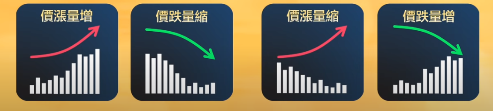
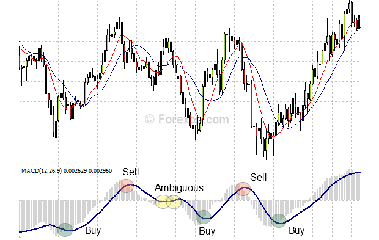

# 技术面分析

## 线图分类

- 价格：K线，均线
- 数量：成交量
- 指标：MACD

## K线

显示内容：开盘，收盘，最高，最低

颜色：

- 红色：高开低走
- 绿色：低开高走
- 黄色or 白色：开盘收盘不变

可根据时间度量调整：日K,周K，月K

Tips：

- 昨日收盘和今日开盘不在一条线上（盘前盘后交易）
- 如果显示多条横线，且不在同一高度，说明一开盘就涨停/跌停（中国）

## 均线

移动平均线（过去一段时间以来的平均成本）所以当当日股价跌破均线，说明亏了，5t说明五天内的人亏了，`季线不能跌破。抛股，更低。`

符号：
- 5T/MA(一周)
- 10T（两周）
- 20T(一个月)
- 60T（一季度）
- 120T（半年）
- 240T（一年）

术语：
- EMA：指数平均指标，时间越近，权重越大
- MA5：连续五天收盘价均值，权重一样。但实际上权重应该不一样。

## 成交量

成交量: 交易张数的加总。（大盘成交量=张数*成交价格）

> 实际成交的买百入和卖出是相等的，因为这本来就是一笔成交的双方。你所说度的不等，应该是指主动性买入和主动性卖出吧。这个问几个例子，比如卖一上价格是答10.1，买一是10，现在如果有人以10.1或以上的价格委托买入，就会被计入回主动性买入，如果有人主动以10元或以下的价格抛答出，就计入主动性卖出。

颜色:

- 表明今日股价涨跌
- 比如昨日收盘高于今日收盘，今日红色。

理解：

- 成交量增幅越大，说明买卖双方看法越不一致
- 越小，说明双方看法一致

> 如：双方都看涨，买的人想买，但没人卖。一个看涨一个看跌，买卖交易量就上涨了。

## 指标：MACD

基础概念：
- EMA 12天，EMA26天，两均线的差离值（DIF），
- 对DIF再求均值比如过去5天DIF均值，就是DEA,DEM值

MACD指标是由两线一柱组合起来形成
- 快速线为DIF
- 慢速线为DEA
- 柱状图为MACD（DIF-DEA）×2

在各类投资中，有以下方法供投资者参考：

1. MACD金叉：DIF 由下向上突破 DEA，为买入信号。
2. MACD死叉：DIF 由上向下突破 DEA，为卖出信号。
3. MACD 值由负变正，市场由空头转为多头。
4. MACD 值由正变负，市场由多头转为空头。
5. DIF 与 DEA 均为正值,即都在零轴线以上时，大势属多头市场，DIF 向上突破 DEA，可作买入信号。
6. DIF 与 DEA 均为负值,即都在零轴线以下时，大势属空头市场，DIF向下跌破 DEA，可作卖出信号。

Tips:

- 一般情况下，在交叉信号产生后的第二天或第三天，会有一个回调，此刻可以再行买入，达到摊低成本的目的。
- 若DIF第二次由下向上与DEA交叉，预示着将产生一波力度较大的上升行情，在交叉信号产生后，投资者应当一路持股，直到DIF再次由上向下交叉DEA时，再将所有的股票清仓.

熊背离:

- 概念： 当DIF与DEA两指标位于0轴的上方, MACD指标常会与K线走势图呈背离的走势，通常称为熊背离。
- 既K线走势图创出的第二个或第三个高点，MACD指标并不配合出现相应的高点，却出现相反的走势，顶点在逐步降低。
- 此种现象应引起投资者的警觉，因为它预示着今后将有大跌行情产生，所以投资者宜采用清仓离场的策略，使自己的股票避免被套，资金避免受到损失。

牛背离:

- 当DIF与DEA两指标位于0轴的下方时，说明的大势属于空头市场，在空头市场经过C浪下跌以后，偶尔也会发生MACD指标与K线走势图产生背离的现象，通常称为牛背离。
= 既K线走势图出现第二或第三个低点，MACD指标并没有相应的低点产生，却出现一底高过一底的相反走势
- 这种现象的产生，预示着行情在今后会发生反转走势，投资者应当积极介入，因为市场根本没有风险。

