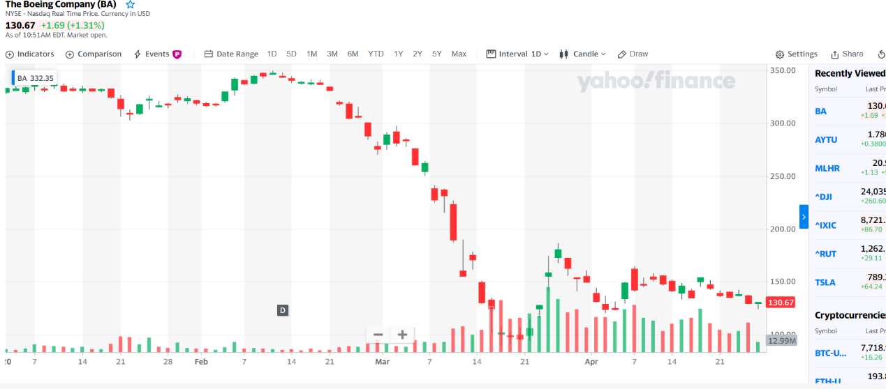

# 技术面分析

## 线图分类

- 价格：K线，均线
- 数量：成交量
- 指标：MACD

## K线

显示内容：开盘，收盘，最高，最低

颜色：

- 红色：高开低走
- 绿色：低开高走
- 黄色or 白色：开盘收盘不变

可根据时间度量调整：日K,周K，月K

Tips：

- 昨日收盘和今日开盘不在一条线上（盘前盘后交易）
- 如果显示多条横线，且不在同一高度，说明一开盘就涨停/跌停（中国）

## 均线

移动平均线（过去一段时间以来的平均成本）所以当当日股价跌破均线，说明亏了，5t说明五天内的人亏了，`季线不能跌破。抛股，更低。`

符号：
- 5T/MA(一周)
- 10T（两周）
- 20T(一个月)
- 60T（一季度）
- 120T（半年）
- 240T（一年）

## 成交量

成交量: 交易张数的加总。（大盘成交量=张数*成交价格）

颜色:

- 表明今日股价涨跌
- 比如昨日收盘高于今日收盘，今日红色。

理解：

- 成交量增幅越大，说明买卖双方看法越不一致
- 越小，说明双方看法一致

> 如：双方都看涨，买的人想买，但没人卖。一个看涨一个看跌，买卖交易量就上涨了。

