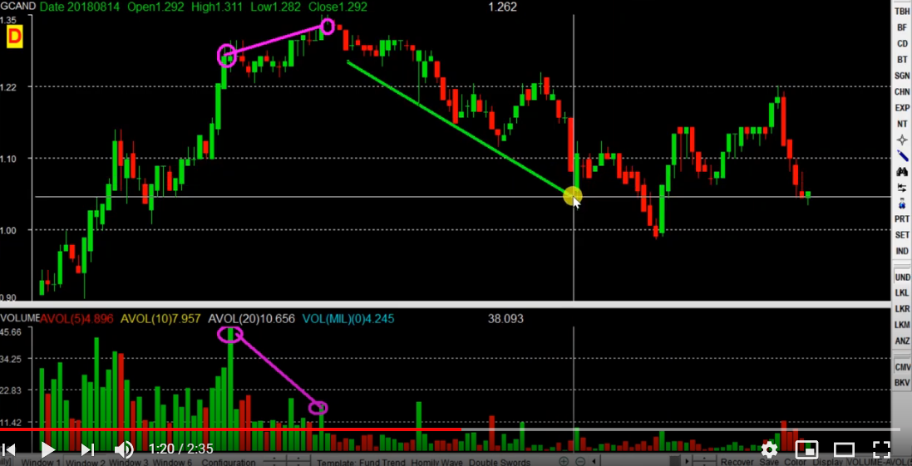
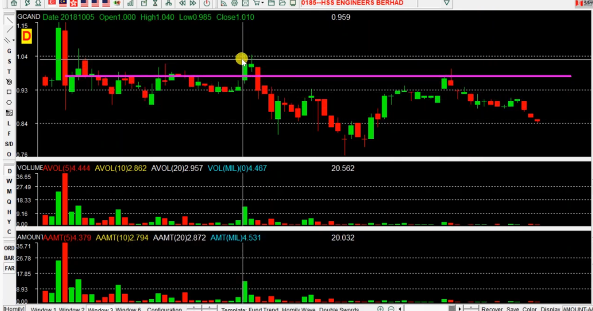
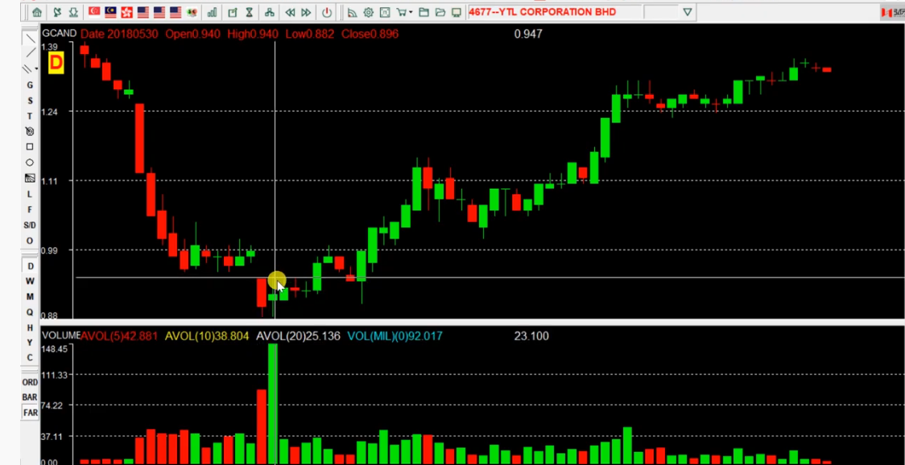
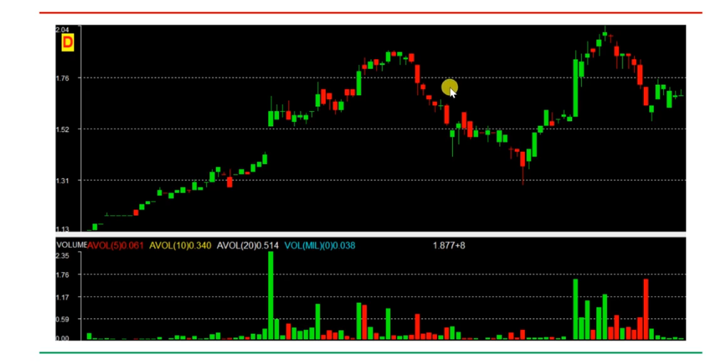
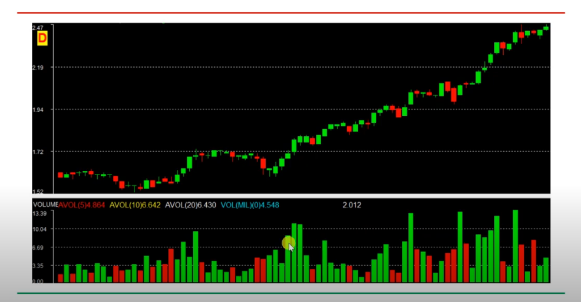
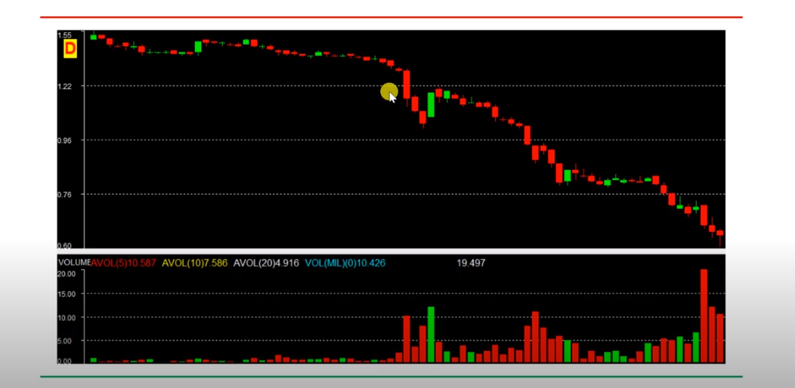
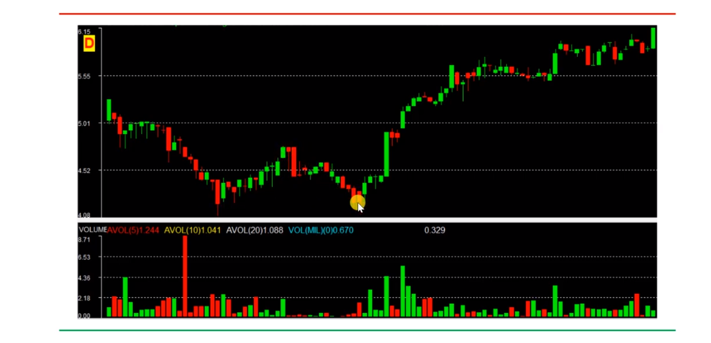
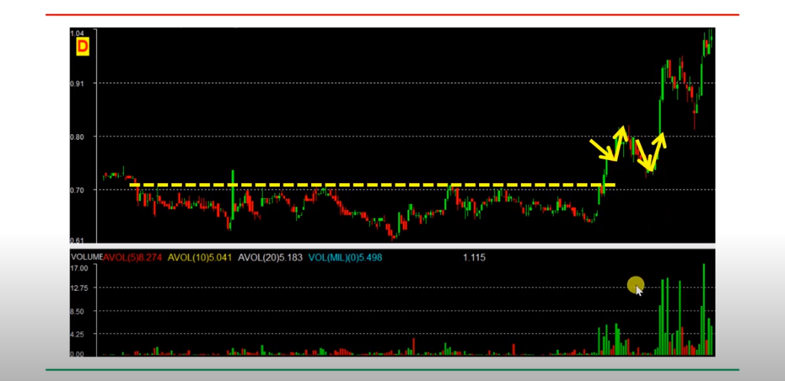
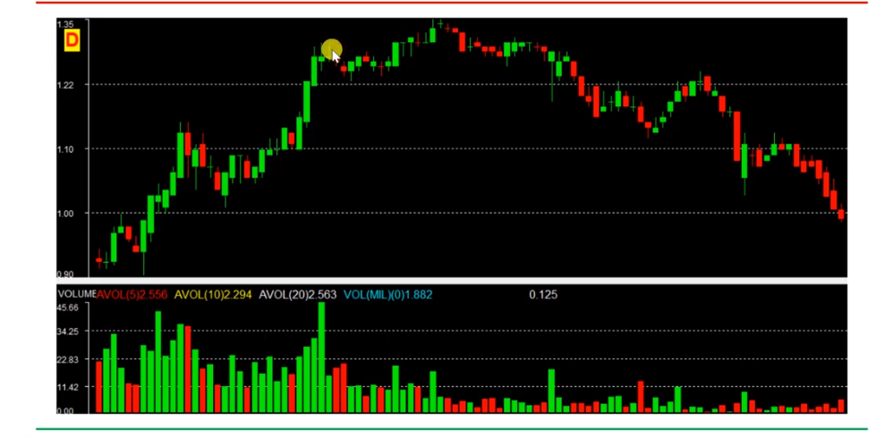
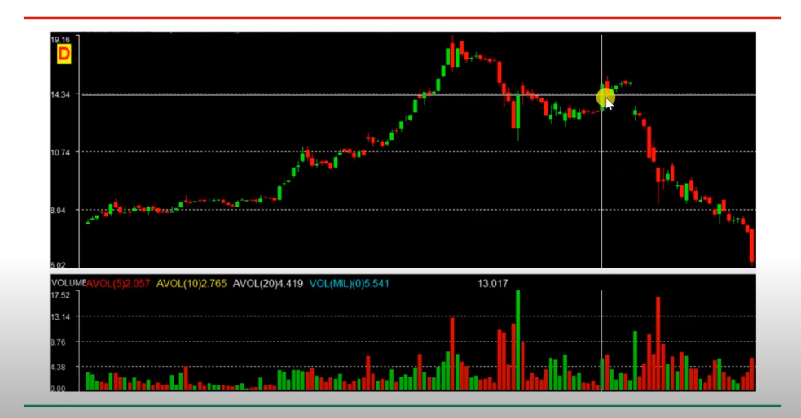

# 价量分析

正常形态: `价跌量缩，价升量升`

8种形式分析

## 1.量价背离

价升量缩，价升量平，价平量缩，可能股价下跌

## 2. 成交量大，后期。价格下压

买者，买入下跌，股价反弹的时候，大量抛出，反复出现

压力位：找到交易量大的当天股价。

但如果成交量大之后，股价上涨，形成支撑点。

支撑位和压力位:

- 支撑位：阻止股价继续下跌的点位，股价下跌产生，当投资者认为股价下跌至最低，会大量人群买入，将会给股票吃止泻药一样导致股价回升。从而形成支撑点。
- 压力位：股价上升受到压力的点位。
- 两者会转换。不可靠。

## 3.今日量小，今后股价上涨压力小，（长得快）

前期上涨或下跌时成交量很小，投入少，行情好转，股价上涨阻力小。

## 4.成交量放大（频繁进出），看涨，股价上升。坚定持股信心

新人进入，卖出买入。   看涨心态比较强烈

## 5.股价下跌时成交量放大

5.1 看涨看跌不一致
5.2 前期买入的人卖股

> 价跌量升，不健康，不能加入（多出现在牛市，刚开始下跌的时候，这个时候最好不去参与）

## 6. 二度下探量缩，股价见底

`第二次股价下跌，差不多就是股价的最低点`

- 至第一次最低点附近，成交量小于第一次，成交量小，分歧小。
- 抛盘穷尽，止跌见低的信号。
- 现象：成交量放大，股价上升。

- 重要趋势位被突破，上升，下降，上升，下跌。
- 股价将见底，只要成交量放大，股价会快速回升。

## 7. 二度回升量缩，股价将见顶

- 买盘穷尽，止涨见顶
- 已经上涨一段时间，该卖，成交量萎缩，顶部。

## 8. 趋势下降缩量长阳下，应卖

成交量不是很大，卖出时机。

- 下降趋势形成，很难改变
- 受庄家操控

